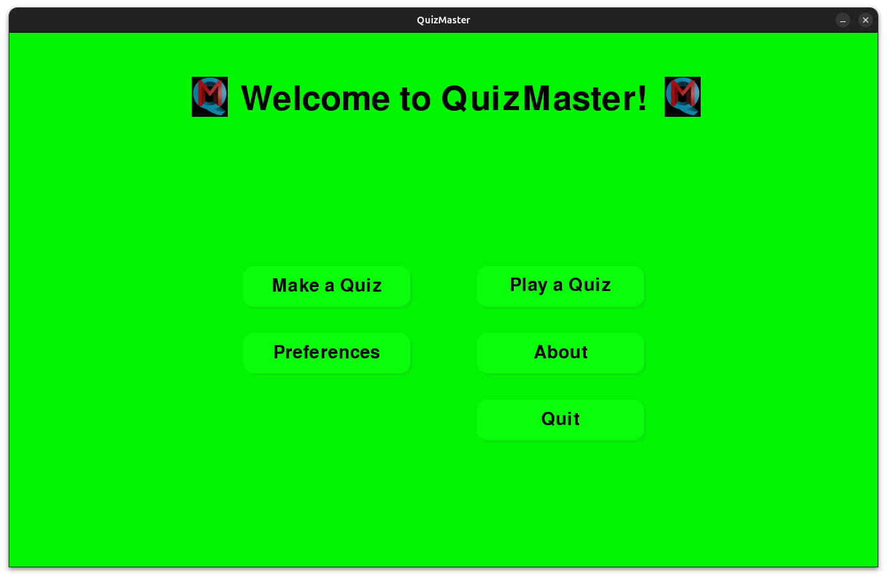
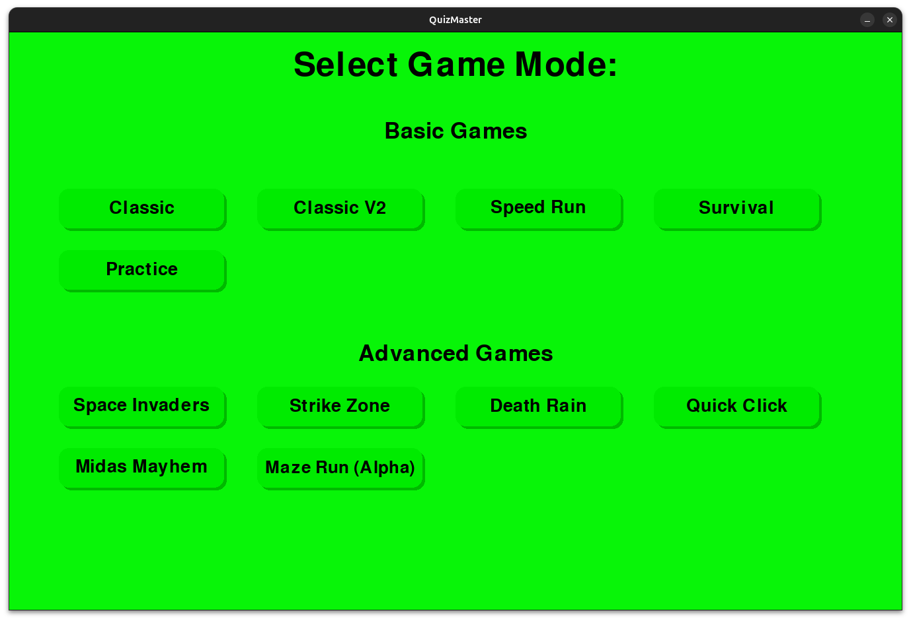
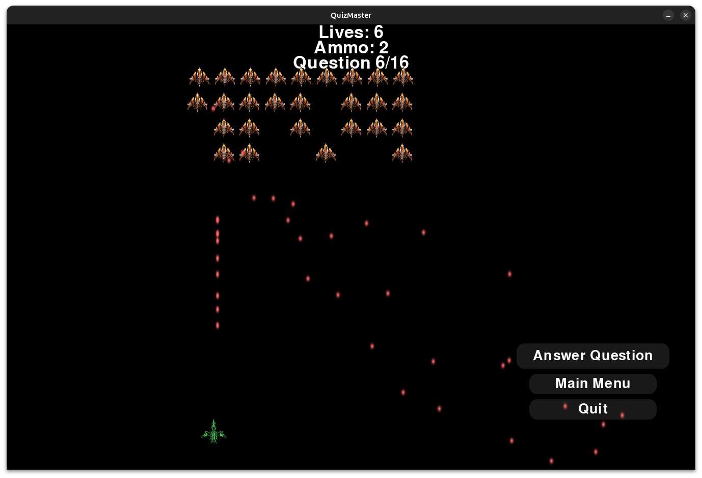
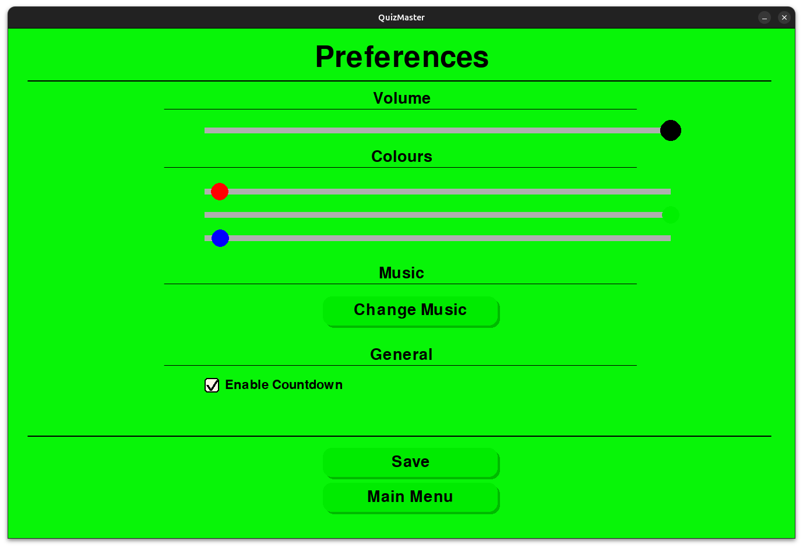

[](http://www.gnu.org/licenses/gpl-3.0.html)

# QuizMaster

 

QuizMaster is a fun game testing your knowledge and cognitive ability in many different areas. 
 If you can copy and paste text into the command line interface and clone a repository, you're all set to dive in!
If you've got some useful knowledge on top of this, you can create a quiz on it with `QuizCreator` and create a [pull request](https://docs.github.com/en/pull-requests/collaborating-with-pull-requests/creating-a-pull-request).

## Table of contents

- [Usage](#usage)
  - [Installation](#installation)
  - [Running QuizMaster](#running-quizmaster)
    - [Playing a Quiz](#playing-a-quiz)
    - [Preferences](#preferences)
    - [Quiz Creator](#quiz-creator)
    - [Adding Arguments](#adding-arguments)
- [Tutorials](#tutorials)
- [Other QuizMaster Versions](#other-quizmaster-versions)
- [Future Work](#future-work)

## Usage

### Installation

1. Clone this repository via terminal: 

```git clone --recurse-submodules https://github.com/hermonochy/QuizMaster```

  If you prefer not to include the example quizzes, you can omit the `--recurse-submodules` flag: 
  
  ```git clone https://github.com/hermonochy/QuizMaster```

2. Enter the directory containing the game executable: ```cd QuizMaster```

##### Either:

Run the included script `./setup.sh` (Linux) or `setup.bat` script for Windows (known issues with msys2 python conflict, only worry about this if you are a C++ developer). Do not worry if these scripts take some time to complete.

##### Or: (Advanced, Linux/Mac only):

1. Set up a new virtual environment: ```python3 -m venv venv```
2. Activate the environment: ```source venv/bin/activate``` (To decativate, type `deactivate`)
3. Install tkinter: ```sudo apt-get install python3-tk``` 
(If you do not use Debian or Ubuntu, you will have to find out your package manager for yourself and replace `apt-get`.)
4. Install packages in `requirements.txt`: ```pip3 install -r requirements.txt```

*Steps 1 and 2 are optional, but recommended if you wish to avoid a headache with Python module conflicts.*

### Updating QuizMaster

QuizMaster is constantly worked on and your copy can quickly become outdated. To update it, simply run `./update.sh` for Linux or `update.bat` for Windows. For windows users, it is always a good idea to run the setup files after updating, in case a module requirement or other is changed. The Linux script does this automatically.

### Running QuizMaster

To start the application, enter `./run.sh` for Linux or `run.bat` for Windows, into the command line interface (Don't forget to run setup files before launching QuizMaster if anything has changed).

### Playing a Quiz

 You'll be greeted by the homepage where you have the option to `Play a Quiz` or `Make a Quiz`. Selecting `Make a Quiz` opens [`QuizCreator`](#quiz-creator), while `Play a Quiz` takes you into the game. To select a quiz, simply type the theme you would like to play. Alternatively, you can also select a random quiz or a general knowledge quiz, the latter of which takes random questions from random quizzes to create a new and unique quiz. Afterwards, it will request you select a game mode ([see below](#game-modes)).



*The homepage*

#### Game modes

Various game modes exist to allow the user to test different strengths in different areas. From the classic countdown to speed runs that challenge your quick thinking, each mode is designed to provide a unique experience. For most of the game modes, scores greater than 80% are above average, between 80% and 40% is average, and less than 40% is below average. Below are brief overviews of the current game modes.



*The Game Mode selection window*

##### Basic Game Modes

QuizMaster game modes are split into two sections: Basic and Advanced. Basic game modes are more focused on the learning, while Advanced game modes are essentially games, more for entertainment than learning. 

 **Classic**

The *classic* game mode allows you to answer questions with a countdown timer. Your score is recorded, and at the end, it will give advice appropriate to the score. Players can choose answers using keyboard inputs allocated to the answer, or mouse clicks, but be mindful of the timer!

**Classic V2**

Similar to *Classic*, the time limit of *Classic V2* is the absolute time, rather than induvidual time limits. This game mode is generally the easiest of all.

**Speed Run**

Race against the clock to answer all questions correctly as fast as possible! An incorrect answer forces you to retry the question, and losing all lives results in starting the quiz anew. Your total time is recorded to push for improvement in future attempts. Currently, it's the most challenging game mode.

**Survival**

In *Survival* mode, players are allotted a limited number of lives to complete the quiz. Each incorrect response results in a life deduction, and the game concludes when you either exhaust your lives or answer all questions correctly. The objective is to survive as long as possible by maintaining accuracy throughout.

**Practice**

A more laid-back approach, this mode allows you to engage in practice sessions at your own pace. You receive immediate feedback on your answers and can choose to continue or end the quiz whenever you wish. Scores are not tracked in this mode, and you can reveal the answer if stuck.

##### Advanced Game Modes

**Space Invaders**

A visually engaging, feature-rich arcade mode where you defend your ship against waves of aliens by answering quiz questions and blasting through enemies. Each correct answer earns you ammo, while wrong answers cost you lives. Aliens come in several types, including tougher and shooter variants. Earn “kill currency” by defeating aliens and spend it in the in-game shop to buy power-ups such as speed boosts, shields, auto-fire, increased ammo, and more. Most power-ups are time-limited but can turn the tide of battle in your favor, if used properly. Unlike the original arcade game, you can still keep hold of your lives if hit, if you can answer the survival question correctly! The game ends if you run out of lives or aliens reach your ship.



*A Space Invaders game*

**Strike Zone**

A frantic 2D survival shooter that combines quiz action with fast-paced dodging and shooting. Navigate your character to avoid incoming enemies and answer questions to unlock power-ups and ammo. Use a growing arsenal of upgradable weapons—Pistol, SMG, Shotgun, Sniper, Burst Rifle, Laser, Mine, Rocket and Missile—each with its own strengths and tactical uses. Defeat enemies to earn score and spend it in the “Gun Shop” to unlock new weapons during play. Power-ups appear randomly on the battlefield and require you to answer a quiz question to collect their bonus—these include extra ammo, health, shields, and an all-out attack that wipes out all on-screen enemies. Once you have had enough and the button is enabled, click on `End Game` to exit. Strategic use of ammo, weapon choice, and timely question answering are key to surviving until the end. Be wary of your mines. You may just fall into your own trap!

|Powerup|Colour|Chance of Appearance|Function|
|----|----|----|----|
|Ammo Provider|🟡️|50%|+25 Ammo|
|Life Restorer|🟢️|30%|+5 lives|
|Shield|🟠️|15%|10 seconds immunity to enemy attacks|
|All-out Attack|⚪️|5%|Sends out a blast of energy that destroys all enemies on the screen|

**Farm Frenzy**

In this vibrant game mode, your goal is to plant, grow, and harvest as many crops as possible while answering quiz questions. To get started, use your seeds to plant crops by selecting an empty plot (press keys 1 to 7 or click a plot). Each crop type grows at a different speed and rewards you with coins when harvested. Correctly answering quiz questions gives you extra seeds and coins, helping you expand your farm. As you progress, pests will begin to appear—these mischievous bugs can eat your crops unless you use your upgrades. You can visit the farm shop at any time to spend your coins on upgrades: speed up crop growth, restore farm hearts, buy more seeds and more! If you run out of farm hearts, the game ends, so stay alert! Your ultimate aim is to complete all the quiz questions with a flourishing, pest-free farm and a basket full of harvested crops.

**Blast Field**

Players navigate a grid‑based arena, planting bombs. When a payload detonates, a multiple‑choice question appears in the blast radius. Answering correctly awards points, a wrong answer looses them a life. The goal is to survive as long as possible while racking up a high score.

**Midas Mayhem**

Test your luck and knowledge in this gold-collecting challenge! In *Midas Mayhem*, each correct answer lets you open a magical chest, but not all chests are friendly—some give you gold, some take it away, and others multiply your fortune or wipe it out. Build up as much gold as you can by answering questions correctly and picking wisely. But beware: falling into debt means game over!

**Maze Run**

Navigate through a randomly generated maze, collecting quiz questions scattered throughout. Your goal is to answer all questions and reach the maze exit. Each question blocks your path until you answer it, and wrong answers will be tallied at the end.

**Death Rain**

Dodge falling obstacles as you pilot your character across the screen. Occasionally, power-ups will appear—collect them and answer a quiz question to gain temporary a boost in speed! It is advised to save the power-ups until later in the game, where the projectiles really start moving! If an obstacle hits you, the game ends and your score is tallied. The longer you survive, the faster and more challenging the game becomes.

**Quick Click**

Questions bounce unpredictably around the screen, and it’s your job to click on them and answer as many as you can, as quickly as you can! Each correct answer increases your score. The game tracks your time and score, challenging you to improve your speed and accuracy with each playthrough.

#### Preferences

There is a preferences window where you can change the song, volume, and background colour:



*The Preferences window*

#### Quiz Creator


*The QuizCreator window, having loaded a Harry Potter quiz*

1. Run quizcreator by opening QuizMaster and clicking `Make a Quiz`. You can also start it separately with `./quizcreator` on the command line interface in Linux.
2. Use it to manage and create quiz questions. Click `Add` to include multiple choice questions and ensure you specify the correct answer followed by wrong answers separated by commas. Tooltips provide helpful guidance throughout the process.
3. Once you have saved it, using the `Save` button or `Save As` for an entirely new quiz, you can easily test-play it using the `play` button, which opens the quiz in practice mode.

#### Adding Arguments

The file `quiz.py` also allows for the quiz path, game mode and volume to be added as arguments when starting the program. This is primarily for quick testing of a quiz; a shortcut for quiz makers.

```
usage: quiz [-h] [-q [QUIZPATH]] [-g [GAMEMODE]] [-v [VOLUME]]

Main program for QuizMaster. Features include: Playing quiz, preferences and starting QuizCreator.

options:
  -h, --help            show this help message and exit
  -q [QUIZPATH], --quizPath [QUIZPATH]
  -g [GAMEMODE], --gameMode [GAMEMODE]
  -v , --volume         enter a float (decimal) between 0 and 1
```

###### Current Game Mode Options

- `classic`
- `classicV2`
- `speedRun`
- `survival`
- `practice`
- `midasMayhem`
- `mazeRun`
- `spaceInvaders`
- `deathRain`
- `Farm Frenzy`

Similarly in QuizCreator, a quiz parameter can be added to the end but for obvious reasons not a game mode parameter.

```
usage: QuizCreator [-h] [-q [QUIZPATH]]

Side program for QuizMaster, to make quizzes.

options:
  -h, --help            show this help message and exit
  -q [QUIZPATH], --quizPath [QUIZPATH]
```

## Tutorials

Our [Organization](https://github.com/QuizMaster-world) contains several tutorials for using QuizMaster.

- [A Basic QuizMaster Tutorial](https://quizmaster-world.github.io/Tutorials/QuizMaster.html)


## Other QuizMaster Versions

While the original QuizMaster app is by far the most feature-rich and aesthetically pleasing option, there are several alternative versions tailored for different use cases and user preferences. All of these versions are organized under the [QuizMaster organization](https://github.com/QuizMaster-world), providing quick accessibility to all. Below is a brief overview of each version:

- [QuizMasterMini](https://github.com/hermonochy/QuizMasterMini): This scaled-down version is designed for use on smaller devices or for users who may have budgetary constraints regarding data volumes. It retains many of the core functionalities, making it a suitable alternative for those who need a simpler interface without sacrificing key features.

- [QuizMasterTerminal](https://github.com/QuizMaster-world/QuizMasterTerminal): A minimalist iteration of QuizMaster, QuizMasterTerminal uses only 1.4 MB of storage. The significant difference here is the absence of a graphical user interface; all interactions occur via the terminal. This makes it an excellent choice for users comfortable with command line operations and those using resource-constrained environments.

- [MicroQuizMaster](https://github.com/QuizMaster-world/MicroQuizMaster): As the lightest version of all QuizMasters, MicroQuizMaster is a mere 7 KB in size. Unlike QuizMasterTerminal, it does not include any example quizzes, focusing instead on ultra-lightweight functionality for users with the lowest-specification devices. It is *particularly* aimed at **Windows** users or those seeking a no-frills experience with minimal resource consumption.

- [QuizMasterPaper](https://github.com/QuizMaster-world/QuizMasterPaper) offers a printable version of quizzes that can be used in offline or classroom settings, given in either PDF or TXT. Unlike the other repositories, there is no quiz game but the quizcreator can still read the json format present in other repos.

- QuizMaster-web: Currently in the early stages of development, QuizMaster-web aims to bring the QuizMaster experience to web browsers. This version is expected to provide a more versatile and accessible web-based application of the QuizMaster app, allowing users to engage with quizzes directly in their browsers without requiring any downloads or installations.

Each version of QuizMaster caters to specific needs and environments, ensuring that users can find an appropriate solution that matches their capabilities and preferences.

## Summary

### Quiz Game:

- Classic game mode with timing and score recording (Classic/Classic V2).
- Timed quiz questions with countdown (Speed Run).
- Ability to answer questions and receive scores.
- Background music during gameplay.
- Start QuizCreator
- Customise background colour and music

### Quiz Creator:

- Add, Edit, Delete, Duplicate, Open, Save, and Load functions for quiz questions.
- Interactive GUI interface for managing quiz questions.

---

Engage with QuizMaster, where creating and playing quizzes is fun and interactive! We welcome contributions to enhance this project further—if you have new quizzes to share, please submit a pull request to [the submodule for quizzes](https://github.com/QuizMaster-world/Quizzes). 

*Please note: Some example quizzes may contain inaccuracies, as they have been contributed to by AI or younger students from the [Cheney School](https://github.com/Cheney-School) branch of [Oxcobu](https://oxcobu.github.io/).*

## Future Work

- More methods of answering questions
- Adding pictures to questions
- More user-friendly method of installing the game
- Multiplayer option
- ~~Different game modes~~
- Web app version
- Add links to external sources
