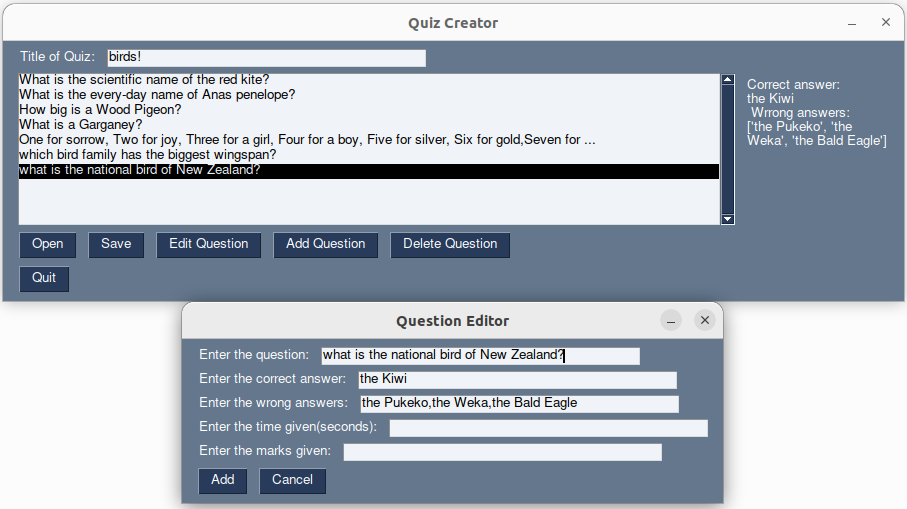
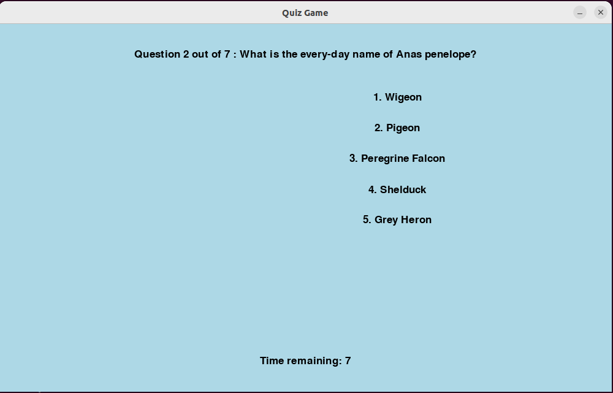
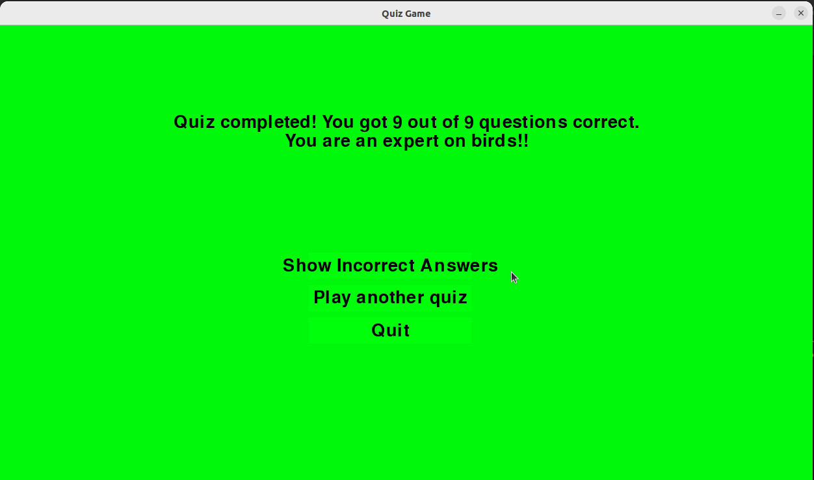

# Quiz

This Python code consists of two parts: a Quiz Creator and a Quiz Game. The Quiz Creator tool allows you to add, edit, delete, save, and load quiz questions. Quiz Creator uses PySimpleGUI. The Quiz Game, built with pygame, lets you play the quiz with timed questions.

## How to Use

### Install
1. Clone this repository `git clone https://github.com/hermonochy/QuizMaster.git`
2. Set up a new virtual environment `python3 -m venv .`(optional, but recommended).
3. Start the environment.`source ./bin/activate`
4. Install tkinter.`sudo apt-get install python3-tk`
5. Install packages in `requirements.txt`.`pip3 install -r requirements.txt`
6. Run either Quiz Creator or Quiz Game (see below).

### Quiz Creator

1. Run the script `./quizcreator` 
2. Use it to manage and create quiz questions.The add button you can add questions. As it is multiple choice, you need to give a correct awnser and wrong awnsers, seperating them with commas.Afterwards, save it. Format is json.

### Quiz Game

In a command line window, enter `./quiz`. Choose a json file and play.You can either press the number given to the awnser or, if you don't have a keyboard, click on the awnser. Remember, you only have 10 seconds! At the end it will tell you your score and either congratulate you or suggest you revise depending on the score.

## QuizMasterMini
 [QuizMasterMini](https://github.com/hermonochy/QuizMasterMini) is a smaller version of the application, made for weaker devices.

## Features

### Quiz Creator:
- Add, Edit, Delete, Save, Load functions for quiz questions.
- Interactive GUI interface for managing quiz questions.

### Quiz Game:
- Timed quiz questions with countdown.
- Ability to answer questions and receive scores.
- Background music during gameplay.

## Functions

- `add_question()`: Add a new question to the quiz list.
- `edit_question()`: Edit a selected question from the list.
- `delete_question()`: Delete a selected question from the list.
- `save_quiz()`: Save the quiz questions to a JSON file.
- `load_quiz()`: Load a quiz from a JSON file.
- `quiz_game()`: Play the quiz game with loaded questions.

Enjoy the combined functionalities of creating quizzes and playing quiz games with the Quiz Creator and Quiz Game applications provided in this code!Please add some extra quizzes for others. This repository is open to pull requests.

## Future Work

- more methods of awnsering questions
- adding pictures to questions
- more user friendly method of starting
- more user friendly interface
- multiplayer options
- different game modes

