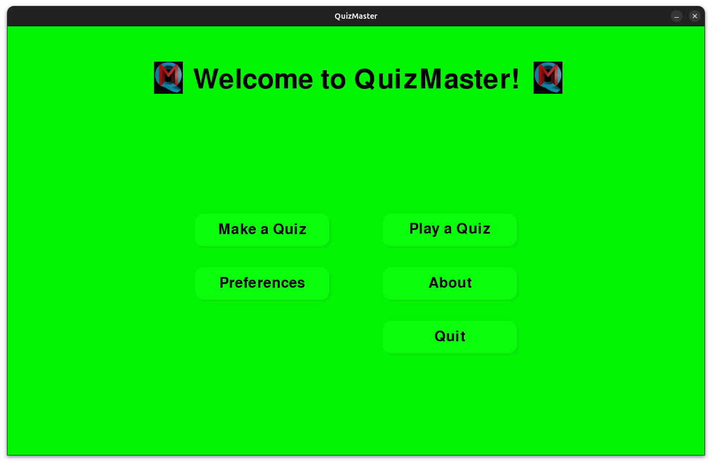
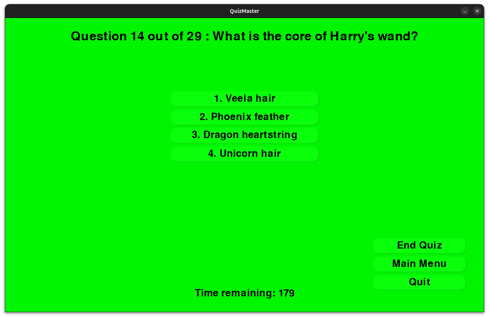
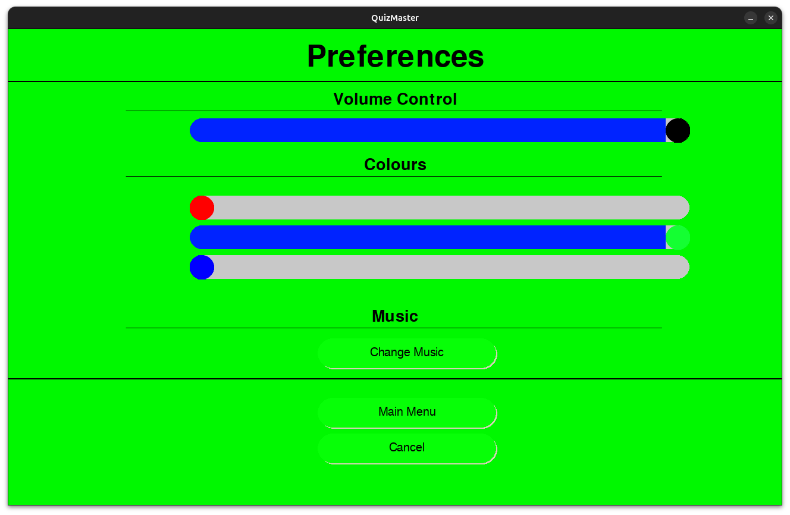
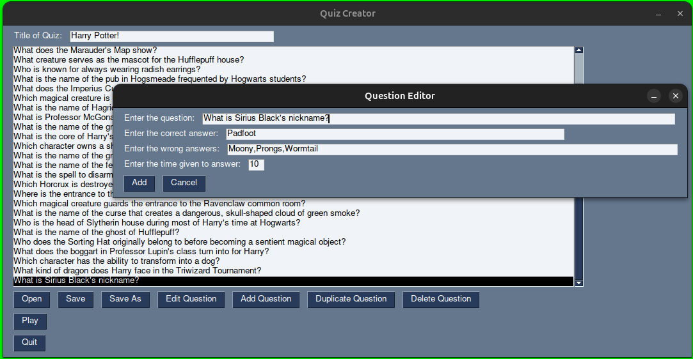

# QuizMaster

QuizMaster is a fun game testing your knowledge and cognitive ability in many different areas. 
If you know how to copy and paste text to the command line interface, and can copy or clone this repository, then you're in. 
If you've got some useful knowledge on top of this, you can create a quiz on it with `QuizCreator` and create a [pull request](https://docs.github.com/en/pull-requests/collaborating-with-pull-requests/creating-a-pull-request).

## Usage

### Installation

#### Either:

1. Clone this repository via terminal ```git clone https://github.com/hermonochy/QuizMaster```
2. Enter the directory containing the game executable: ```cd QuizMaster```

#### Or:

1. Download the Zip file
2. Extract the Zip file
3. Enter the directory

#### Then:

Run the command ```pyinstaller quiz.py```. If this does not work, attempt installing pyinstaller: ```pip install pyinstaller```.

#### If you are a Developer:

The `quiz` file is a binary, but the `quiz.py` file contains the actual python code. For this to work, the dependencies need to be manually installed. 

##### Either

Run the included script `./setup.sh` (Linux) or `setup.bat` script for Windows (known issues with msys2 python conflict, only worry about this if you are a C++ developer). These scripts may take some time to complete.

##### Or: (Advanced, Ubuntu/Debian only):

1. Set up a new virtual environment: ```python3 -m venv venv```
2. Activate the environment: ```source venv/bin/activate``` (To decativate, type `deactivate`)
3. Install tkinter: ```sudo apt-get install python3-tk```
4. Install packages in `requirements.txt`: ```pip3 install -r requirements.txt```

*Steps 1 and 2 are optional but recommended.*

##### Adding Arguments

The file `quiz.py` also allows for the quiz path, game mode and volume to be added as arguments when starting the program. This is primarily for quick testing of a quiz; a shortcut for quiz makers.

```
usage: quiz [-h] [-q [QUIZPATH]] [-g [GAMEMODE]] [-v [VOLUME]]

Main program for QuizMaster. Features include: Playing quiz, preferences and starting QuizCreator.

options:
  -h, --help            show this help message and exit
  -q [QUIZPATH], --quizPath [QUIZPATH]
  -g [GAMEMODE], --gameMode [GAMEMODE]
  -v , --volume         enter a float (decimal) between 0 and 1
```

###### Game Mode Options

- classic
- classicV2
- speedRun
- survival

Similarly in QuizCreator, a quiz parameter can be added to the end but for obvious reasons not a game mode parameter.

```
usage: QuizCreator [-h] [-q [QUIZPATH]]

Side program for QuizMaster, to make quizzes.

options:
  -h, --help            show this help message and exit
  -q [QUIZPATH], --quizPath [QUIZPATH]
```

### Quiz Game

In a command line window, enter `./dist/quiz/quiz` to start the application in Linux, or `dist/quiz/quiz` for Windows. To start the python file in Linux, enter `./run.sh` and `run.bat` for Windows.


 Press either `Play a Quiz` or `Make a Quiz` in the homepage. `Make a Quiz` will open [QuizCreator](#quiz-creator), `Play a Quiz` will start the game (see below).



#### Game modes

##### Classic Game

The classic game mode allows you to answer questions with a countdown timer. Your score is recorded, and at the end, it will give advice appropriate to the score. Scores greater than 80% are above average, between 80% and 40% is average, and less than 40% is below average. You can either press the number allocated to the answer or, if you don't have a keyboard, click on the answer. Remember, you have a time limit!



##### Classic V2

Similar to classic, the time limit of classic V2 is the absolute time, rather than induvidual time limits. This game mode is generally the easiest of all.

##### Speed Run

The speed run game mode challenges you to answer all questions correctly in the shortest time possible. If you answer a question incorrectly, you must redo the question. If three questions are answered incorrectly, you must redo the entire quiz. The game keeps a stopwatch running throughout, and your final time is displayed at the end. Currently it is the most difficult game mode.

##### Survival

The Survival game mode is a challenging addition to QuizMaster. In this mode, players have a limited number of lives to answer questions correctly. Each incorrect answer costs a life, and the game ends when the player loses all their lives or answers all questions correctly. The objective is to survive as long as possible while maintaining accuracy. This mode tests both knowledge and endurance, making it a thrilling experience for quiz enthusiasts.

### Preferences

There is a preferences window where you can change the song, volume, and background colour:



### Quiz Creator



1. Run quizcreator by opening QuizMaster and clicking `Make a Quiz`. You can also start it separately with `./quizcreator` on the command line interface in Linux.
2. Use it to manage and create quiz questions. The `Add` button can add questions. As it is multiple choice, you need to give a correct answer and a set of wrong answers, separated by commas. Further instructions can be viewed via the implemented tooltips.

## Other QuizMaster Versions

While the original QuizMaster app is by far the most feature-rich and aesthetically pleasing option, there are several alternative versions tailored for different use cases and user preferences. All of these versions are organized under the QuizMaster organization, providing quick accessibility to all. Below is a brief overview of each version:

- [QuizMasterLite](https://github.com/hermonochy/QuizMasterLite): This scaled-down version is designed for use on smaller devices or for users who may have budgetary constraints regarding data volumes. It retains many of the core functionalities, making it a suitable alternative for those who need a simpler interface without sacrificing key features.

- [QuizMasterTerminal](https://github.com/QuizMaster-world/QuizMasterTerminal): A minimalist iteration of QuizMaster, QuizMasterTerminal is a mere 1.4 MB of storage. The significant difference here is the absence of a graphical user interface; all interactions occur via the terminal. This makes it an excellent choice for users comfortable with command line operations and those using resource-constrained environments.

- [MicroQuizMaster](https://github.com/QuizMaster-world/MicroQuizMaster): As the lightest version of all QuizMasters, MicroQuizMaster is a mere 7 KB in size. Unlike QuizMasterTerminal, it does not include any example quizzes, focusing instead on ultra-lightweight functionality for users with the lowest-specification devices. It is *particularly* aimed at **Windows** users or those seeking a no-frills experience with minimal resource consumption.

- [QuizMasterPaper](https://github.com/QuizMaster-world/QuizMasterPaper) offers a printable version of quizzes that can be used in offline or classroom settings, given in either PDF or TXT. Unlike the other repositories, there is no quiz game but the quizcreator can still read the json format present in other repos.

- QuizMaster-web: Currently in the early stages of development, QuizMaster-web aims to bring the QuizMaster experience to web browsers. This version is expected to provide a more versatile and accessible web-based application of the QuizMaster app, allowing users to engage with quizzes directly in their browsers without requiring any downloads or installations.

Each version of QuizMaster caters to specific needs and environments, ensuring that users can find an appropriate solution that matches their capabilities and preferences.

## Summary

### Quiz Game:

- Classic game mode with timing and score recording (Classic/Classic V2).
- Timed quiz questions with countdown (Speed Run).
- Ability to answer questions and receive scores.
- Background music during gameplay.
- Start QuizCreator
- Customise background and music

### Quiz Creator:

- Add, Edit, Delete, Duplicate, Open, Save, and Load functions for quiz questions.
- Interactive GUI interface for managing quiz questions.

Enjoy the combined functionalities of creating quizzes and playing quiz games with the Quiz Creator and Quiz Game applications provided in this code! Please add some extra quizzes for others. This repository welcomes contributions from everyone. 

*Warning: Many of the example quizzes are written by AI or schoolchildren, so they may contain incorrect or silly information.*

## Future Work

- More methods of answering questions
- Adding pictures to questions
- More user-friendly method of installing the game
- Multiplayer option
- ~~Different game modes~~
- Web app version
- Add links to external sources
