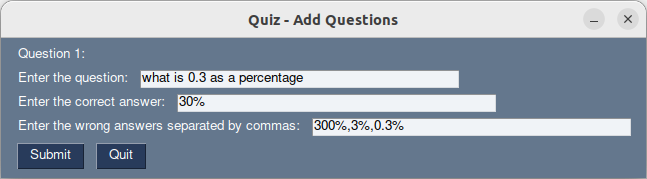

# Quiz Application

This application allows users to create and take a quiz with multiple-choice questions. 
 
 
 
## How to Use

### Creating the questions 
- run the code with `python3 quizmaker.py`
- type in the number of questions in the quiz and press start
- fill in the fields.
- press submit

### Playing the quiz

- run the code with `python3 quiz.py` 
- select the correct awnser and press next. At the end a popup will apear to tell you your score.

## Dependencies

- PySimpleGUI: A simple GUI framework for Python.

## Future work

- more user-friendly appearance
- fixing of bugs
- more methods of awnsering
- adding images as an awnser option
