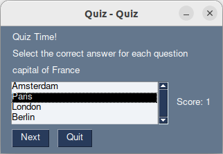

# Quiz Application

This application allows users to create and take a quiz with multiple-choice questions. 
 
 
 
## How to Use

1. Run the code with `python3 main.py`
2. Enter the number of questions you want to add and click on the `Start` button.
3. For each question, enter the question, correct answer, and other answers separated by commas.
4. Once all questions are added, the quiz will start.
5. Select the correct answer for each question and click `Next` to move to the next question.
6. You can reveal the correct answer at any time by clicking `Reveal Correct Answer`.
7. After completing the quiz, a popup will display your score out of the total number of questions.

## Dependencies

- PySimpleGUI: A simple GUI framework for Python.

## Future work

- more user-friendly appearance
- fixing of bugs
- more methods of awnsering
