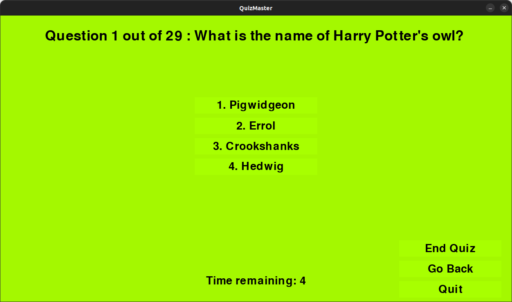

# QuizMaster

QuizMaster is a fun game testing your general knowledge and cognitive ability in many different areas. 
If you know how to use the command line interface, and can clone this repository from github, then you're in.
If you've got some useful knowlege on top of this, you can create a quiz on it with `QuizCreator`.

## How to Use

### Installation

1. Clone this repository `git clone https://github.com/hermonochy/QuizMaster.git`
2. Enter the directory containing the game executable: `cd QuizMaster`

#### Option 1 (Easy):

Run the included script `./setup.sh` (Ubuntu/Debian) or `setup.bat` (known issues with msys2 python conflict, only worry about this if you are C++ dev) script for windows. Note: these scripts may take some time to complete.

#### Option 2 (Advanced, Ubuntu/Debian only):

1. Set up a new virtual environment: `python3 -m venv venv`(optional, but recommended).
2. Activate the environment: `source venv/bin/activate`
3. Install tkinter: `sudo apt-get install python3-tk`
4. Install packages in `requirements.txt`: `pip3 install -r requirements.txt`

### Quiz Game

In a command line window, enter `./run.sh` to start the code in Linux, or `run.bat` for Windows. Press either `Play a Quiz` or `Make a Quiz` in the homepage. `Make a Quiz` will open QuizCreator, `Play a Quiz` will allow you to search a quiz to play! You can either press the number allocated to the answer or, if you don't have a keyboard, click on the awnser. Remember, you have a time limit!

 At the end it will tell you your score and either congratulate you or suggest you revise depending on the score.
 

There is a preferences window where you can change the song, volume and colour:

### Quiz Creator

1. Run quizcreator by opening QuizMaster and clicking "Make a quiz". You can also start it separately with `./quizcreator` on the command line interface in Linux.
2. Use it to manage and create quiz questions. The `Add` button can add questions. As it is multiple choice, you need to give a correct answser and wrong answers, seperated with commas. Afterwards, save it in an apropriate folder with a `.json` file extension.

## QuizMasterMini
 [QuizMasterMini](https://github.com/hermonochy/QuizMasterMini) is a smaller version of the application, made for smaller devices or people on a budget with data volumes.

## Features

### Quiz Creator:
- Add, Edit, Delete, Save, Load functions for quiz questions.
- Interactive GUI interface for managing quiz questions.

### Quiz Game:
- Timed quiz questions with countdown.
- Ability to answer questions and receive scores.
- Background music during gameplay.
- Start QuizCreator
- Change settings

Enjoy the combined functionalities of creating quizzes and playing quiz games with the Quiz Creator and Quiz Game applications provided in this code! Please add some extra quizzes for others. This repository is open to pull requests.
Note: Many of the example quizzes are AI written, so may contain incorrect information.

## Future Work

- more methods of answering questions
- adding pictures to questions
- more user friendly method of installing the game
- multiplayer options
- different game modes

